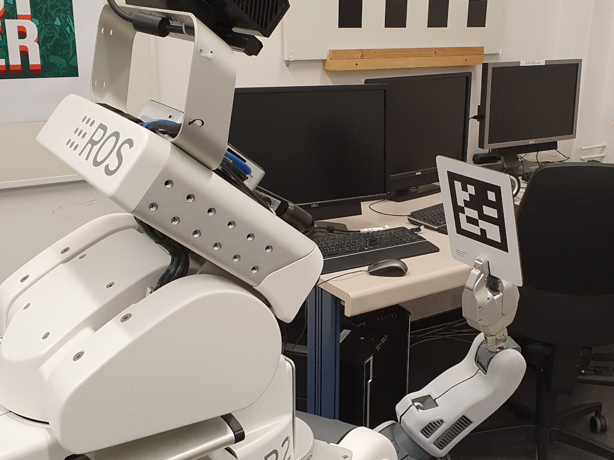
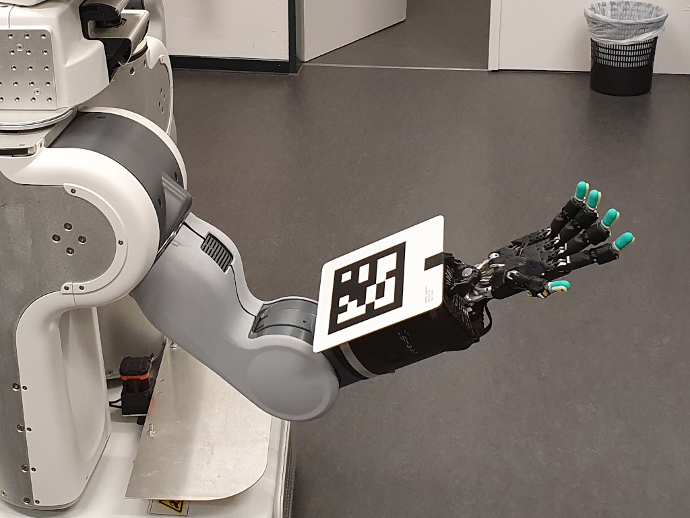

Calibrating a PR2 or Trixi is not as straight forward as it seems, as we not only need to calibrate a camera or a kinematic chain, but a whole robot mobile platform. In the following list, all parts that needs to be calibrated are shown, we are able to calibrate all **checked** entries whithin this tutorial:

#### Cameras:
- [ ] narrow/wide stereo
- [ ] forarm_left
- [x] kinect2
- [ ] asus

#### Kinematics:
- [x] right arm
- [x] left arm
- [x] head (including kinect2 extrinsic)
- [ ] torso
- [ ] caster

#### Lasers:
- [ ] tilt
- [ ] tray laser
- [ ] base laser

#### Arm springs

## Calibration procedure:

#### 1. Kinect2

The first and probably most important step is the calibration of the kinect2 camera, cause a lot of other calibration steps rely on this (arm, head, and torso kinematics).

The kinect node runs on the host system of pr2-head. Since the calibration doesn't work with X-forwarding in the moment, it is necessary to plug in a monitor, a mouse, and a keyboard into the NUC (restart might be required).

To calibrate the kinect2 camera, follow the steps in [this](https://github.com/code-iai/iai_kinect2/tree/master/kinect2_calibration) tutorial and execute them on the NUC.

#### 2. Left arm and head

As we use a yaml to load absolute calibration values in a urdf.xacro file to upload the robot_description, it is necessary to use the branch 'tams_pr2' of [this](https://github.com/Jntzko/robot_calibration) fork of the robot_calibration package. (Also necessary if you want to use apriltags)  

To calibrate the left arm, the pan and tilt joint of the head, and the extrinsic position of the kinect2, it is necessary to capture position and orientation data of a known object at the end of the kinematic chain. In this case a checkerboard(or an apriltag).

2.1. To move the left arm to multiple sample poses start the following node:

```rosrun tams_pr2_calibration left_arm sample_poses```

Follow the instructions and place the checkerboard in the left gripper.



2.2. Start the [robot_calibration](http://wiki.ros.org/robot_calibration) node with the following launch file:

```roslaunch tams_pr2_calibration left_arm_checkerboad.launch```   
(```roslaunch tams_pr2_calibration left_arm_apriltag.launch```)

2.3. Follow the instructions on the command line, move the arm to a new sample pose and capture a picture alternating.

2.4. At the and the procedure outputs an yaml file with absolute calibration values (/tmp/calibration_absolute_TIMESTAMP), copy the new values into the config file (tams_pr2/tams_pr2_description/config/calibration_config.yaml).

2.5. Restart ros to apply the new values.

#### 3. Right arm

The procedure of the right arm is quite similar to the left arm.
3.1. Attach the checkerboard (or apriltag) with the [device](../tams_pr2/media/calibration_wiki/r_arm_cal_adapter.scad) on the backside provided for this purpose, as shown in the picture.


  
Start the sample pose node:

```rosrun tams_pr2_calibration right_arm_sample_poses```

3.2. Start the [robot_calibration](http://wiki.ros.org/robot_calibration) node with the following launch file:

```roslaunch tams_pr2_calibration right_arm_checkerboad.launch```   
(```roslaunch tams_pr2_calibration right_arm_checkerboad.launch```)

3.3. Follow the instructions on the command line, move the arm to a new sample pose and capture a picture alternating.

3.4. At the and the procedure outputs an yaml file with absolute calibration values (/tmp/calibration_absolute_TIMESTAMP), copy the new values into the config file (tams_pr2/tams_pr2_description/config/calibration_config.yaml).

3.5. Restart ros to apply the new values.

#### 4. Calibrating the other sensors

To calibrate the unchecked sensors you can take a look at [this](https://wiki.ros.org/pr2_calibration/Tutorials/Calibrating%20the%20PR2) tutorial.

If you calibrated one of those, please shortly describe it in this wiki and mark the respective checkbox.